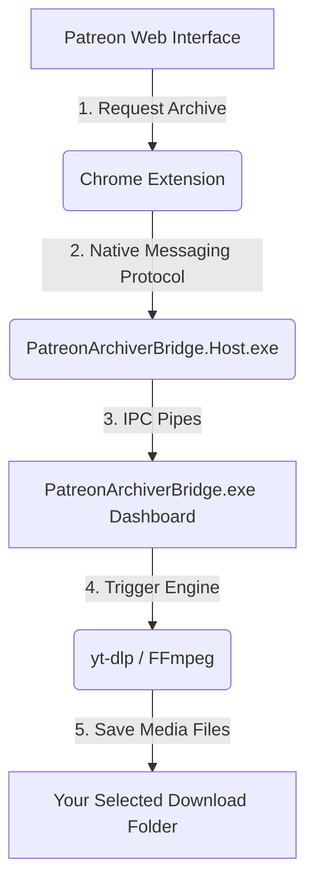

# 🎥 Patreon Archiver Bridge

[](https://polyformproject.org/licenses/noncommercial/1.0.0)
[-lightgrey.svg)](#)
[](#)

Patreon Archiver Bridge is the Windows desktop companion for the Patreon Archiver Chrome Extension. It serves as a secure native messaging host, connecting your web browser to a high-performance downloader engine powered by `yt-dlp` and `FFmpeg`. 

Designed with modern Windows 11 aesthetics, it offers a seamless background downloading experience with dynamic Mica transparency, real-time status tracking, and automated background updates.

---

## 📸 Preview

*Below are visual highlights of the Patreon Archiver Bridge interface:*

| **Dashboard (Light Mode)** | **Dashboard (Dark Mode)** |
|:---:|:---:|
|  |  |

| **Custom Setup Wizard** | **In-App Auto-Updater** |
|:---:|:---:|
|  |  |

*(Note: Replace placeholders in the `assets/` folder with actual screenshots of your running application for a perfect presentation!)*

---

## ✨ Features

- **🚀 Native Browser Integration:** Uses secure Chromium Native Messaging to receive download links directly from the Chrome Extension.
- **🎨 Windows 11 Aesthetics:** Premium Mica / Acrylic backdrop effects, fluid transitions, and seamless Light/Dark mode themes.
- **📦 Fully Custom Setup Wizard:** Standalone setup wizard with custom path selection, automatic system check, and clean shortcuts creation.
- **⚡ Automatic Dependency Management:** Downloads, configures, and caches `yt-dlp` and `FFmpeg` automatically on first start.
- **🔄 Auto-Updater (Velopack):** Queries your GitHub Releases in the background and applies updates instantly with a gorgeous in-app progress panel.
- **🧹 Clean Uninstaller:** Removes all binary files, registry configurations, desktop/start menu shortcuts, and logs completely and cleanly.

---

## 🛠️ How It Works

The archiver uses a secure three-tier architecture to fetch and save your media files safely:



---

## 📥 Installation

### 1. Download the Installer
Click the link below to download the latest setup wizard:
> **[📥 Download PatreonArchiverBridge_setup.exe (Latest Version)](https://github.com/r1kp/patreon-archiver-bridge/releases/latest/download/PatreonArchiverBridge_setup.exe)**

### 2. Bypass Windows SmartScreen (Unsigned App)
Since this app is freshly built and not code-signed with a commercial certificate, Windows SmartScreen will display a warning:
1. Right-click the downloaded `PatreonArchiverBridge_setup.exe`.
2. Select **Properties** (Eigenschaften).
3. Under the **General** (Allgemein) tab, check the **"Unblock"** (Zulassen) box at the bottom.
4. Click **Apply** and then **OK**.
5. Run the installer and proceed with the glassy setup wizard!

---

## 💻 Developer Guide (Building from Source)

### Prerequisites
- [.NET 9.0 SDK](https://dotnet.microsoft.com/download/dotnet/9.0)
- PowerShell 5.1+

### Building & Packaging
To build the binaries, package them with Velopack, and embed them inside the custom installer, simply run the PowerShell packaging pipeline script in the repository root:

```powershell
# Build and package version 1.0.0
.\pack_app.ps1 -Version 1.0.0
```

This script will:
1. Publish the UI, Host, and Uninstaller projects.
2. Package them into a Velopack release folder.
3. Embed the silent installer into `PatreonArchiverBridge.Setup`.
4. Compile the custom self-contained Setup Wizard.
5. Save the final setup executable in `publish\PatreonArchiverBridge_setup.exe`.

---

## 📄 License

This project is licensed under the **PolyForm Noncommercial License 1.0.0**. You are free to view, modify, and distribute this software for personal and non-commercial purposes. Commercial distribution or usage is strictly prohibited.

See the [LICENSE](LICENSE) file for details.
