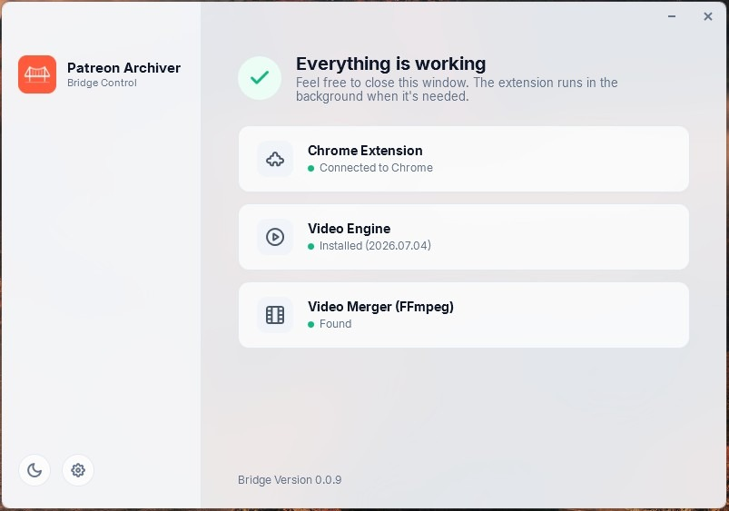
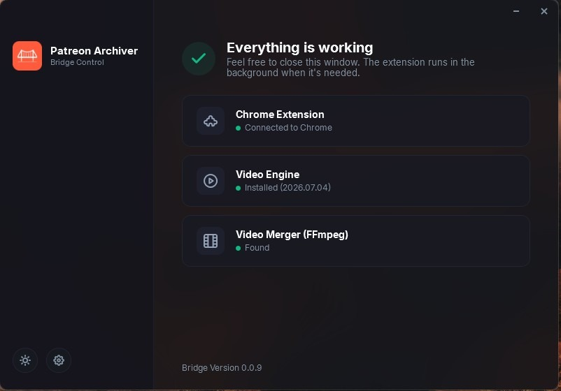

<div align="center">


# Patreon Archiver Bridge

[](LICENSE)
[](#requirements)
[](https://dotnet.microsoft.com/)
[](#architecture)
[](https://velopack.io/)
[](https://github.com/r1kp/patreon-archiver-bridge/releases/latest)

**A lightweight native Windows companion app that lets the Patreon Archiver Chrome extension save files directly to disk.**

[Download](#installation) · [Features](#features) · [How It Works](#how-it-works) · [Building from Source](#building-from-source) · [Related Projects](#related-projects)

</div>

---

## Table of Contents

- [About](#about)
- [Features](#features)
- [Screenshots](#screenshots)
- [Installation](#installation)
- [How It Works](#how-it-works)
- [Building from Source](#building-from-source)
- [Uninstalling](#uninstalling)
- [Related Projects](#related-projects)
- [Roadmap & Feedback](#roadmap--feedback)
- [Built with AI (Transparency)](#built-with-ai-transparency)
- [Contributing](#contributing)
- [License](#license)

---

## About

Chrome extensions cannot write directly to your file system due to security restrictions. **Patreon Archiver Bridge** is the solution: a small, modern native Windows companion application that runs in the background and handles the actual file downloading and writing on behalf of the [Patreon Archiver](#related-projects) browser extension using Chrome's native messaging API.

No external Python runtimes, no manual configuration required — just a single, self-contained setup.

---

## Features

- **Native WPF Dashboard** — view connection status, active downloads, and media engine statistics at a glance.
- **Native Messaging Bridge** — communicates with the Chrome extension over standard stdio pipes without opening ports.
- **Self-Contained Installer** — single executable installer containing all dependencies; runs without requiring a pre-installed .NET runtime on the host PC.
- **Auto-Updates (Velopack)** — the application checks for updates silently in the background and installs them automatically.
- **Clean Uninstaller** — completely removes all binaries, start menu/desktop shortcuts, registry entries, and logs.
- **Free & Open Source** — code is open under a non-commercial license with no telemetry or tracking.

---

## Screenshots

<div align="center">




<sub>Screenshots highlighting the different theme options.</sub>

</div>

---

## Installation

1. Download the latest **`PatreonArchiverBridge_setup.exe`** from the [Releases page](https://github.com/r1kp/patreon-archiver-bridge/releases/latest).
2. Because the installer is freshly compiled and not code-signed yet, Windows SmartScreen will flag the installer with a "Windows protected your PC" (Der Computer wurde durch Windows geschützt) warning. To proceed:
   - Click on the **"More info"** (Weitere Informationen) link in the warning text.
   - Click the **"Run anyway"** (Trotzdem ausführen) button that appears at the bottom.
3. Choose your preferred installation path and follow the on-screen instructions.
4. Install the [Patreon Archiver Chrome extension](#related-projects) — it will automatically connect to the Bridge.

> **Note:** The other files attached to the release (`.nupkg`, `.json`, unpackaged `.exe`) are used internally by the auto-updater and don't need to be downloaded manually.

### Requirements

- Windows 10 / 11 (64-bit)
- Google Chrome
- [Patreon Archiver Chrome Extension](#related-projects)

---

## How It Works

```
Chrome Extension  <── native messaging (stdio) ──>  PatreonArchiverBridge.exe  <──>  File System
```

The extension launches the Bridge via Chrome's native messaging host protocol. The Bridge listens on stdin/stdout, receives archive jobs (file data + destination metadata), downloads and writes them to disk using `yt-dlp` & `FFmpeg`, and reports status back to the extension — all without exposing any network port.

### Architecture

| Component | Responsibility |
|---|---|
| `PatreonArchiverBridge` | Main WPF app — dashboard UI, native messaging host, file downloader engine |
| `PatreonArchiverBridge.Setup` | Self-contained custom installer UI, wraps the silent Velopack installer (`-s --installto`) |
| `PatreonArchiverBridge.Uninstaller` | Cleans up registry entries, shortcuts (with/without spaces), and installation directories |

The setup UI is a thin, fully self-contained WPF wrapper that runs the actual Velopack-generated installer silently in the background, so users get a familiar installation experience without exposing Velopack's default UI.

---

## Building from Source

**Prerequisites:** .NET 9.0 SDK, PowerShell

```powershell
git clone https://github.com/r1kp/patreon-archiver-bridge.git
cd patreon-archiver-bridge

# Build and package with Velopack
Remove-Item -Recurse -Force "Releases" -ErrorAction SilentlyContinue
powershell -ExecutionPolicy Bypass -File pack_app.ps1 -Version <version>
```

This produces:
- `publish/PatreonArchiverBridge_setup.exe` — the custom self-contained setup wrapper
- `Releases/*` — the Velopack release assets (`.nupkg`, `-Setup.exe`, feed metadata) used for auto-updates

---

## Uninstalling

Use **Windows Settings → Apps → Patreon Archiver Bridge → Uninstall**, or run the uninstaller directly from the install directory. It removes all registry entries, shortcuts, and leftover files automatically.

---

## Related Projects

| Project | Description | Status |
|---|---|---|
| **[patreon-archiver-extension](https://github.com/r1kp/patreon-archiver-extension)** | The Chrome (Manifest V3) extension this Bridge was built for | 🚧 In development |
| **patreon-archiver-bridge** *(this repo)* | Native Windows companion app | ✅ Active |

---

## Roadmap & Feedback

- I am fully open to your feedback and feature requests!
- If you would like to request support for new platforms, files, or options, feel free to open a feature request in the issues tab.
- Feel free to request changes or contribute ideas to improve the downloading or UI flow.

---

## 🤖 Built with AI & Open Philosophy (Transparency)

I believe in full transparency: this project was created entirely using AI models (vibe coding) with me acting as the project director rather than writing lines of code manually. 

While I do not identify as a traditional developer, I've guided the AI to shape the architecture, design, and user experience of this bridge to be as premium and clean as possible. This approach demonstrates what is possible today with modern AI assistance, and I am proud to share this open-source companion tool with the community!

**My Philosophy:** I use AI assistance to create high-quality applications and browser extensions that are, and will always remain, **completely free of charge for everyone**. My goal is to fight annoying paywalls and locked premium features that plague modern tools, delivering top-tier utilities directly to the community without any cost.

---

## Contributing

Issues and pull requests are welcome. If you run into a bug, please open an issue with your Windows version and, if possible, the console output from running the installer via `cmd`.

---

## License

This project is licensed under the **PolyForm Noncommercial License 1.0.0**. 

You are free to view, copy, modify, and distribute this software for personal and educational purposes. **Commercial use, distribution, or sale of this software (or any modified version of it) is strictly prohibited.**

See the [LICENSE](LICENSE) file for details.
